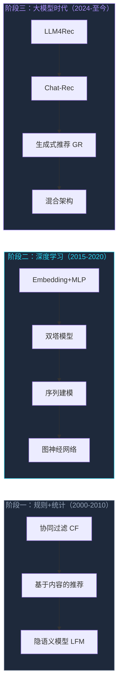

# 推荐算法演进与生成式推荐

**Generative Recommendation: The Paradigm Shift**

汇报类型

技术趋势调研

受众

中台研发团队

日期

2026年5月

■
 推荐系统正处于十年一遇的范式转变窗口

---

# 汇报内容

01

为什么推荐系统正在经历范式转变

三大瓶颈 · GPU利用率 · LLM破局

P2-6

02

推荐算法演进全景图

三条主线 · 算法分类 · 关键技术节点

P8-11

03

生成式推荐核心技术解析

Semantic ID · 超长序列 · 代表工作

P12-18

04

大厂技术路线对比

快手 · 字节 · 京东 · 阿里 · Meta

P19-22

05

工业落地挑战与共识

争议焦点 · 业界共识 · 2026前沿

P23-28

06

中台团队行动建议

短期 · 中期 · 长期行动计划

P29-31

---

# Part 01：范式转变

## 推荐系统为什么正在经历范式转变

📉

PAIN 01

<h3 style="color:#f87171; font-size:1.2em; margin:0 0 12px 0;">优化边际效益递减</h3>

演进路径：DIN → MIMN → SIM → ... 模型越复杂，效果提升越小

<ul style="font-size:0.88em; color:#64748b; line-height:1.8; padding-left:16px; margin:0;">
<li>特征工程"矿山"枯竭</li>
<li>模型工程天花板</li>
<li>优化目标割裂</li>
</ul>

🔗

PAIN 02

<h3 style="color:#fbbf24; font-size:1.2em; margin:0 0 12px 0;">级联架构误差传播</h3>

候选池(亿级) → 召回(万级) → 粗排(千级) → 精排(百级) → 重排(十级)

<ul style="font-size:0.88em; color:#64748b; line-height:1.8; padding-left:16px; margin:0;">
<li>资源消耗超过50%</li>
<li>误差逐级放大</li>
<li>维护成本持续上升</li>
</ul>

⚡

PAIN 03

<h3 style="color:#a78bfa; font-size:1.2em; margin:0 0 12px 0;">GPU资源严重浪费</h3>

传统CTR继承自CPU时代，大量算子是memory-bound

<ul style="font-size:0.88em; color:#64748b; line-height:1.8; padding-left:16px; margin:0;">
<li>H100实际MFU仅~5%</li>
<li>TensorCore大量闲置</li>
<li>架构不改，堆卡无效</li>
</ul>

---

# LLM破局：三重突破同时到来

<h3 style="color:#22d3ee; margin:0 0 20px 0; font-size:1.15em;">为什么是现在？</h3>

1

LLM生态成熟度达到工业级

训练框架 + 推理框架（FlashAttention、PagedAttention）

2

工业级效果验证打破质疑

Meta GR、快手OneRec等论文相继发表

3

业务倒逼技术升级

用户增长见顶，GPU利用率低下的矛盾突出

<h3 style="color:#a78bfa; margin:0 0 20px 0; font-size:1.15em;">LLM带来的破局契机</h3>

Scaling Law

模型规模扩大可预测地提升效果

长序列建模能力

自注意力机制天然适合处理用户行为序列

世界知识注入

预训练语料蕴含跨领域、多模态知识

RL对齐技术

链式推理能力涌现

---

# GPU利用率对比：算力解放是关键

| 指标 | 传统CTR模型 | HSTU基线 | Kunlun优化 | **OneRec-V2** |
|------|------------|---------|-----------|---------------|
| 训练MFU | ~5% | ~17% | ~37% | **62%** |
| 推理MFU | ~7% | ~17% | ~37% | **62%** |
| 算子类型 | Memory-bound | TensorCore密集 | TensorCore密集 | TensorCore密集 |

数据来源

<strong style="color:#94a3b8;">OneRec-V2</strong>（快手，2025.10）：Lazy Decoder-Only架构，MFU达62%，总计算量降低94%

<strong style="color:#94a3b8;">Kunlun</strong>（Meta，2026）：B200 GPU实测，MFU从17%提升至37%

<strong style="color:#94a3b8;">HSTU</strong>（Meta，ICML 2024）：MFU约17%，在线A/B提升12.4%

问题根源

传统CTR模型（如DIN/DCN/DLRM）大量算子是memory-bound的Embedding Lookup，对GPU的TensorCore利用率极低。

价值百万的H100，实际可能只用了5%。架构不改，堆卡解决不了问题。

---

# 推荐算法演进路径

---

# 三条演进主线

主线一

<h3 style="color:#22d3ee; font-size:1.15em; margin:0 0 16px 0;">特征工程 → 端到端学习</h3>

手工特征 → FTRL、FM

自动特征交互 → DeepFM、DCN

端到端序列 → DIN、SIM

主线二

<h3 style="color:#a78bfa; font-size:1.15em; margin:0 0 16px 0;">单阶段 → 多阶段 → 简化重构</h3>

早期：简单模型排序所有候选

↓

级联：召回→粗排→精排→重排

↓

重构：简化级联，探索端到端

主线三

<h3 style="color:#34d399; font-size:1.15em; margin:0 0 16px 0;">判别式 → 生成式</h3>

判别式 → 预估点击概率

生成式 → 直接生成推荐列表

代表：Meta GR、快手OneRec

---

# 生成式推荐 vs 判别式推荐

| 维度 | 判别式推荐 | 生成式推荐 |
|------|-----------|-----------|
| **核心问题** | P(click\|user, item) | Generate(user_history) → [items] |
| **候选集** | 封闭候选集，从中选择最优 | 开放式生成，无中生有 |
| **建模方式** | 逐个打分排序 | 自回归生成下一个/一批item |
| **优化目标** | CTR/CVR等判别损失 | NTP（Next Token Prediction）损失 |

<h4 style="color:#f87171; margin:0 0 12px 0; font-size:1.05em;">判别式</h4>

用户A看了 [商品1, 商品2, 商品3]

↓

模型逐一打分 [0.8, 0.6, 0.7]

↓

返回top-N

<h4 style="color:#22d3ee; margin:0 0 12px 0; font-size:1.05em;">生成式</h4>

用户A看了 [商品1, 商品2, 商品3]

↓

模型自回归生成 "商品4, 商品5, 商品6"

↓

直接返回生成列表

---

# 生成式推荐三条技术路线

| 维度 | Semantic ID生成式（路线A） | 纯生成式（路线B） | 判别式（路线C） |
|---------|---------|------------------------|----------------|
| **核心区别** | RQ-Kmeans量化 + NTP Loss | self-attention + NTP Loss | MLP + AUC/GAUC Loss |
| **Item编码** | RQ-Kmeans量化（中小规模） | 原子ID as token（billion-scale） | 原始ID → embedding lookup |
| **特征交互** | Transformer self-attention | Transformer self-attention | MLP（逐对特征交叉） |
| **输出能力** | 生成item序列 | 生成item序列 | 判别式CTR打分 |
| **代表工作** | TIGER, OneRec | HSTU, Ultra-HSTU | RankMixer, MixFormer |

关键洞察

三条路线的核心分水岭是 <strong style="color:#f1f5f9;">特征交互机制 + 学习范式</strong> 的组合。路线B vs 路线C的本质区别：self-attention（全局关系建模） vs MLP（逐对特征交叉），生成式 vs 判别式。

---

# Semantic ID：视频/商品如何变成Token

<h4 style="color:#22d3ee; margin:0 0 16px 0; font-size:1.1em;">RQ-Kmeans量化</h4>

<pre style="font-family:monospace; font-size:0.95em; color:#22d3ee; line-height:1.7; margin:0;">
视频A → [12, 847, 3291]   ← 三层语义Token
视频B → [12, 851, 4107]   ← L1相同，说明A/B是同类

语义层级：
Level 1: [0-511]  → 粗粒度语义
Level 2: [0-511]  → 中粒度语义
Level 3: [0-511]  → 细粒度语义
</pre>

<h4 style="color:#a78bfa; margin:0 0 16px 0; font-size:1.1em;">为什么不用RQ-VAE？</h4>

RQ-VAE存在严重的codebook collapse（沙漏现象），大量token从不被使用。

RQ-Kmeans强制每个cluster包含等量item，彻底解决此问题。

---

# 快手OneRec：端到端颠覆式路线

<h4 style="color:#22d3ee; margin:0 0 16px 0; font-size:1.1em;">三大技术创新</h4>

① Semantic ID编码

RQ-Kmeans量化：每个视频 → 3个token (L1, L2, L3)，L1+L2+L3 = Semantic ID

② Session-wise生成

一次性生成整个推荐列表，item之间相互感知，更符合真实场景

③ IPA：迭代偏好对齐

训练奖励模型（RM）+ Beam search生成多个候选session + DPO优化

<h4 style="color:#34d399; margin:0 0 16px 0; font-size:1.1em;">线上效果</h4>

+1.6% 停留时长

快手主场景全量上线（论文原文唯一披露数字）

---

# 大厂技术路线对比

| 公司 | 技术路线 | 激进程度 | 代表收益 |
|------|---------|---------|---------|
| **快手** | 端到端生成式 | 颠覆式 | 停留时长+1.6% |
| **字节** | Token-Mixing判别式升级 | 渐进式 | 精排升级，GPU利用率↑ |
| **京东** | 混合架构 | 稳健式 | 推理优化，工程化 |
| **阿里** | 学术深耕 | 研究式 | 显式稀疏性理论突破 |

---

# 快手One系列全景

QARM

2024.11

多模态对齐

→

OneRec基础版

2025.02

端到端生成

→

OneRec工业版

2025.06

线上验证+工程优化

→

INFNet

2025

信息瓶颈理论

---

# 字节技术链

RankMixer

→

TokenMixer-Large

→

OneTrans

→

MixFormer

→

TRM

RankMixer

Token-Mixing替代全连接，判别式也能Scaling

OneTrans

统一Transformer架构，序列建模+特征交互统一

MixFormer

混合注意力机制，抖音全流量上线

---

# 工业落地分级评估

| 落地层级 | 代表工作 | 实际效果 | 专家评估 |
|---------|---------|---------|---------|
| 已上线验证 | 快手OneRec、Meta GR | 停留时长+0.5~1.2% | GuoXun、王喆等认可 |
| 积极推进中 | 字节RankMixer、京东xLLM | 精排升级，GPU利用率提升 | walsonyang等支持 |
| 研究跟进中 | 阿里SSR、百度GRAB | 学术验证，尚未大规模落地 | 技术突破，成本待优化 |
| 存疑观望 | 端到端生成式召回 | 效果收益不稳定 | 陈东文、马进等质疑 |

---

# 核心争议：生成式推荐是未来还是伪命题？

<h4 style="color:#f87171; margin:0 0 16px 0; font-size:1.1em;">反对派观点</h4>

陈东文（资深算法工程师）

"大概需要两三年的时间，在投入大量人力物力却看不到成果后，各厂的生成式推荐项目会虎头蛇尾最终退场。"

<ul style="font-size:0.88em; color:#94a3b8; line-height:1.8; padding-left:16px; margin:0;">
<li>Ground Truth缺失：无法定义单一的"下一个item"</li>
<li>训练样本不足：100万候选item，数据严重稀疏</li>
<li>泛化问题：生成式只能出"光秃秃的item id"</li>
<li>冷启动困境：新item无法生成</li>
</ul>

<h4 style="color:#22d3ee; margin:0 0 16px 0; font-size:1.1em;">支持派观点</h4>

walsonyang（京东零售AI域主架构师）

"过去一年生成式推荐取得了长足实质性进展......正逐步形成区别于判别式的新范式。"

<ul style="font-size:0.88em; color:#94a3b8; line-height:1.8; padding-left:16px; margin:0;">
<li>Meta GR、快手OneRec等均取得较好效果</li>
<li>LLM同时解决效果、效率和冷启动三大难题</li>
<li>快手One系列+抖音RankMixer已验证可行性</li>
</ul>

---

# 落地路径共识

共识一：渐进式替换，不追求一步到位

❌ 一步到位：直接用生成式模型替换整个系统

✅ 渐进替换：在精排或召回模块逐步引入生成式方法

共识二：混合架构是现实选择

生成式召回 → 判别式精排 → 策略重排

混合架构 = 生成式增强 + 判别式保底

共识三：超长序列建模是确定性趋势

用户行为序列化 + 样本重组为user-wise范式 + GPU利用率优化

共识四：推理效率是关键瓶颈

召回：生成式候选集太大，延迟高

精排：1000+候选逐个生成，O(n²)复杂度

---

# 2026年技术前沿

🎯

显式稀疏性

阿里SSR（SIGIR 2026）

结构化稀疏打破Dense瓶颈

🔄

序列训练策略

百度GRAB

Sequence-Then-Sparse解耦训练

📊

信息瓶颈理论

快手INFNet

理论指导的序列压缩

⚡

状态空间模型

美团SUAN

Mamba在推荐中的应用

---

# 短期行动（1-3个月）

📋

行动一：架构评估

<ul style="font-size:0.88em; color:#94a3b8; line-height:1.8; padding-left:14px; margin:0;">
<li>评估现有系统能否承接超长序列建模（>10000行为）</li>
<li>盘点GPU资源利用率（当前MFU约~5%）</li>
<li>识别特征工程"矿山"还剩多少提升空间</li>
</ul>

🔧

行动二：技术储备

<ul style="font-size:0.88em; color:#94a3b8; line-height:1.8; padding-left:14px; margin:0;">
<li>研究Semantic ID的工程实现（RQ-Kmeans）</li>
<li>评估PyTorch/vLLM等框架的推理能力</li>
<li>建立离线实验平台</li>
</ul>

📚

行动三：知识沉淀

<ul style="font-size:0.88em; color:#94a3b8; line-height:1.8; padding-left:14px; margin:0;">
<li>组织团队学习快手OneRec、Meta GR等核心论文</li>
<li>建立推荐算法演进知识库</li>
</ul>

---

# 中期行动（3-6个月）

行动一：试点引入

推荐从精排模块试点（相对低风险）

保持现有召回链路不变，在精排引入Token-Mixing或轻量生成式

备选：召回模块试点（更高收益，更高风险）

引入一路Semantic ID召回，与现有召回结果做融合

行动二：工程优化

<ul style="font-size:0.9em; color:#94a3b8; line-height:2; padding-left:16px; margin:0;">
<li>优化推理框架，提升MFU利用率</li>
<li>实现PagedAttention等关键技术</li>
<li>评估混合精度推理的精度损失</li>
</ul>

---

# 长期行动（6-12个月）

行动一

<h3 style="color:#22d3ee; margin:0 0 16px 0; font-size:1.15em;">架构演进规划</h3>

<pre style="font-family:monospace; font-size:0.92em; color:#94a3b8; line-height:1.8; margin:0;">
Phase 1: 引入超长序列 + Token-Mixing（保守）
         ↓
Phase 2: 增加一路生成式召回（稳妥）
         ↓
Phase 3: 评估端到端生成式精排（激进）
</pre>

行动二

<h3 style="color:#a78bfa; margin:0 0 16px 0; font-size:1.15em;">基础设施准备</h3>
<ul style="font-size:0.92em; color:#94a3b8; line-height:2; padding-left:16px; margin:0;">
<li>特征平台支持变长序列特征</li>
<li>样本存储支持user-wise序列化</li>
<li>推理引擎支持自回归生成</li>
</ul>

行动三：关注成本下降窗口

持续跟踪推理硬件成本变化，评估专用推理芯片可行性

---

# 行动优先级矩阵

| 优先级 | 行动项 | 价值 | 风险 | 建议 |
|-------|-------|------|------|------|
| P0 | 超长序列建模 | 高 | 低 | 立即启动 |
| P0 | GPU利用率优化 | 高 | 低 | 立即启动 |
| P1 | Token-Mixing试点 | 高 | 中 | 3个月内 |
| P1 | Semantic ID召回 | 中 | 中 | 3-6个月 |
| P2 | 端到端生成式精排 | 高 | 高 | 6-12个月 |

---

# 谢谢聆听

欢迎提问与讨论

汇报类型

技术趋势调研

受众

中台研发团队

最后更新

2026年5月

